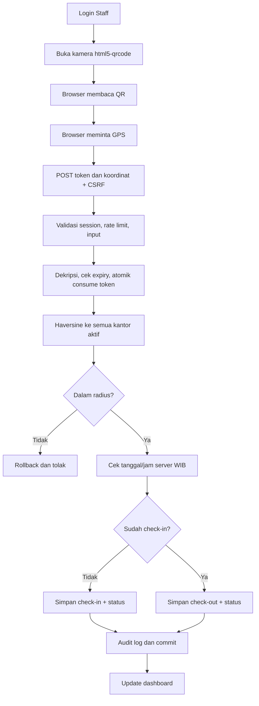

# Alur Absensi

Transaksi database menyatukan konsumsi token dan penulisan attendance. Kegagalan pada tahap apa pun di dalam transaksi di-rollback. Record hari yang sudah memiliki checkout ditolak.

Klasifikasi masuk menggunakan dua batas. Sampai jam mulai Full Time + toleransi menghasilkan `Tepat Waktu / Full Time`. Setelah itu sampai batas mulai Part Time (default 14:00, inklusif) menghasilkan `Hadir / Part Time`, bukan terlambat. Setelah batas Part Time menghasilkan `Terlambat / Part Time`. Pulang sebelum jam pulang − toleransi adalah `Pulang Cepat`, hingga jam pulang `Pulang Normal`, sesudahnya `Lembur`.
