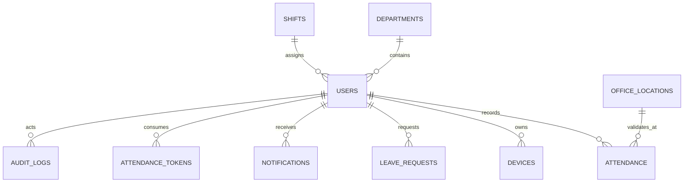

# Database

Migration utama: `app/Database/Migrations/2026-09-15-000001_CreateAttendanceSchema.php`. Dump MySQL siap impor tersedia pada `database/attendance_qr.sql`.

```bash
mysql -u root -p -e "CREATE DATABASE attendance_qr CHARACTER SET utf8mb4 COLLATE utf8mb4_unicode_ci"
mysql -u root -p attendance_qr < database/attendance_qr.sql
```

- `departments`: `id`, nama, kode unik, timestamp, soft delete. Satu divisi memiliki banyak user.
- `office_locations`: koordinat pusat, radius meter, status aktif, soft delete. Direferensikan attendance.
- `shifts`: jam mulai Full Time, batas mulai Part Time, jam pulang, toleransi menit, aktif, soft delete. Satu shift memiliki banyak user.
- `users`: divisi/shift FK nullable, nama, email/NIP unik, password hash, role, aktif, login terakhir, soft delete.
- `attendance`: satu baris per user per tanggal (unique), waktu/koordinat/jarak/status masuk dan pulang, klasifikasi `work_type` Full Time/Part Time, serta lokasi kantor FK.
- `attendance_tokens`: hanya hash SHA-256 token, expiry, pemakai dan waktu pemakaian. Ciphertext tidak disimpan.
- `devices`: fingerprint hash per user, nama, IP dan last seen; disiapkan untuk kebijakan perangkat terpercaya.
- `leave_requests`: rentang izin/sakit/cuti, status dan admin penyetuju.
- `notifications`: pesan per pengguna dan waktu dibaca.
- `audit_logs`: aktor, tindakan, entitas, JSON sebelum/sesudah, IP, waktu; append-only.



Indeks utama mencakup `(user_id, attendance_date)`, `(attendance_date, check_in_status)`, expiry/used token, status cuti, dan entitas audit.
